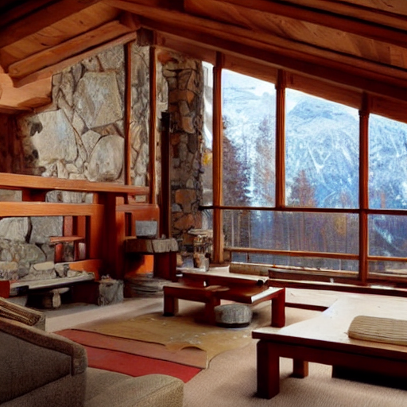

# Text to Mesh

The included notebook takes a text prompt and generates a 3D mesh using __[Stable Diffusion pipeline](https://huggingface.co/docs/diffusers/api/pipelines/stable_diffusion/text2img)__ using diffusers and generate an image, __[DPTForDepthEstimation](https://huggingface.co/docs/transformers/main/en/model_doc/dpt#transformers.DPTForDepthEstimation)__, and the __[Open3D library](http://www.open3d.org/)__

### Prompt
`interior of a mountain chalet by frank lloyd wright`

### Image

### Mesh
[mesh.webm](https://github.com/timzero/text_to_mesh/assets/277352/e90541cd-7829-4e20-b96e-c6b73ecd8e92)
